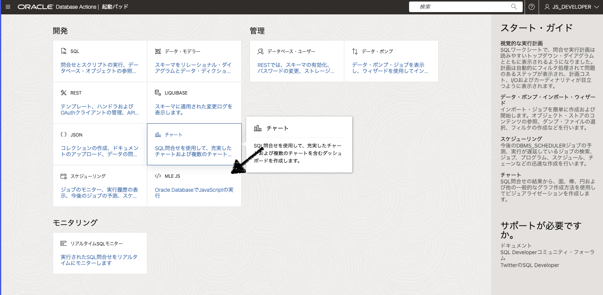
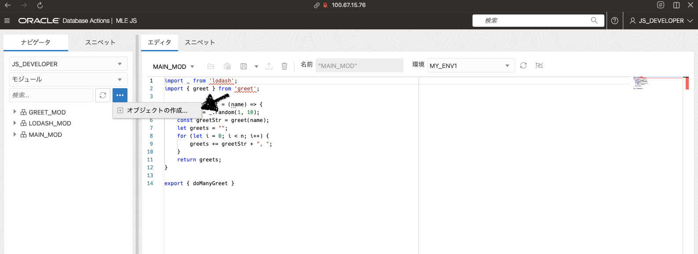
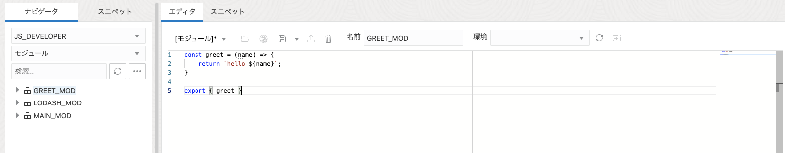
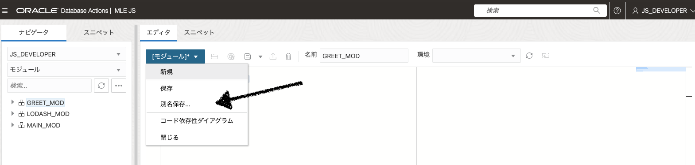
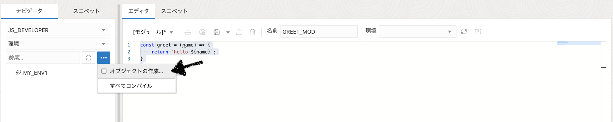
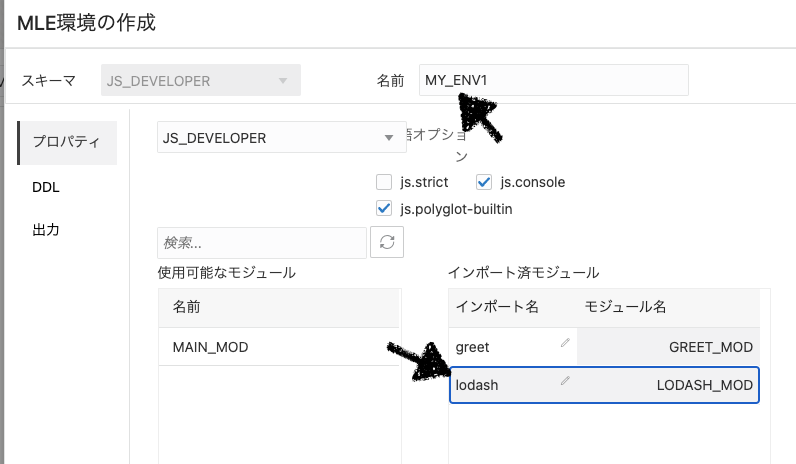
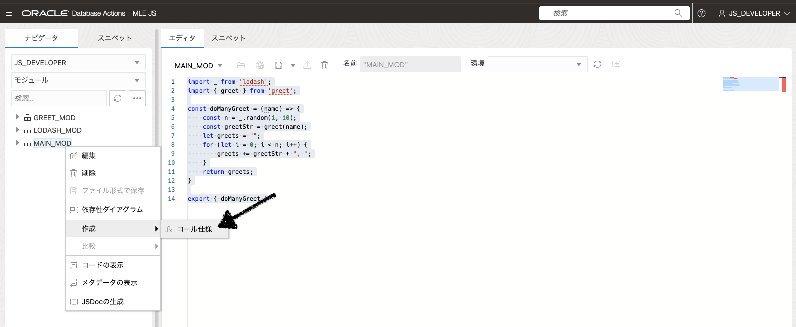
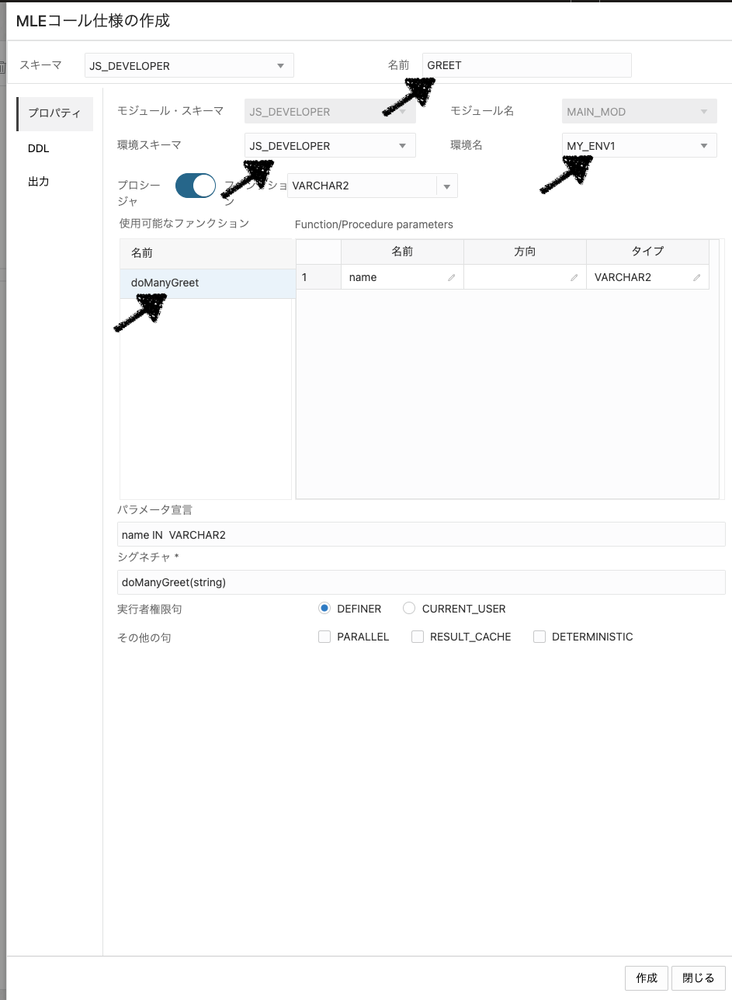

# Javascript In MLE

以下の記事(MLE Javascriptの開発をdatabase actionsで実施する)を試してみます。

https://blogs.oracle.com/developers/post/creating-mle-javascript-modules-in-database-actions

## 手順

GUI経由で以下のModule/Envを作成して実行します。

- Module
  - GREET_MOD…`name`を引数に取り`Hello ${name}`を返す`greet`関数を実装している
  - LODASH_MOD…[lodash](https://lodash.com/)を`module`として公開する
  - MAIN_MOD…`name`を引数に取りランダムな数の`Hello ${name}`を返す`doManyGreet`関数を実装している
- ENV
  - MY_ENV1…上記の`GREET_MOD`と`LODASH_MOD`を`import`している

### GUI接続
以下にアクセスしてJS_DEVELOPERユーザ(パスワードはwelcome1)でログインします。

http://<docker-host-ip>:8080/ords/js_developer/_sdw/

ログインしたら以下からJavascriptのModule作成画面に移動します



### GREET_MOD作成
`モジュール`を選択して`オブジェクト作成`を選択



コードを入力し名前に`GREET_MOD`を入力する。
```javascript
const greet = (name) => {
    return `hello ${name}`;
}

export { greet }
```



`[モジュール]*`を選択し`別名保存`から保存する(`保存`から実行するとスキーマがからということになりなぜか失敗する)



### LODASH_MOD作成
[lodash.min.js](https://cdn.jsdelivr.net/npm/lodash@4.17.21/+esm)を取得してくる(`4.17.21`になっているので、新しいバージョンがあったら他を選択してください)。ここで`lodash-es(lodashのes module用のファイル)`を持ってくるように注意してください。

取得したら`GREET_MOD`のように新規モジュール作成し、エディターに`lodash.min.js`の内容をコピペして保存してください。

### MY_ENV1作成
以下の通り`環境`を選択して`オブジェクトの作成`を選択します



以下のように`環境名`と`インポート済モジュール`を選択して作成する(`インポート名`も変更必要なので注意してください)



### MAIN_MOD作成
他のモジュールと同じように、コードを入力し名前に`MAIN_MOD`を入力し保存する。
```javascript
import _ from 'lodash';
import { greet } from 'greet';

const doManyGreet = (name) => {
    const n = _.random(1, 10);
    const greetStr = greet(name);
    let greets = "";
    for (let i = 0; i < n; i++) {
        greets += greetStr + ", ";
    }
    return greets;
}

export { doManyGreet }
```

### Procedure作成
以下のように`MAIN_MOD > 作成 > コール仕様`を選択する



以下のように`名前`, `環境関連`, `ファンクション`を選択して作成する



### 実行
```bash
## ordsコンテナに接続
docker compose exec -it ords bash

## dbに接続
sqlplus js_developer/welcome1@oracledb:1521/freepdb1

## 実行
select greet('taro');
```